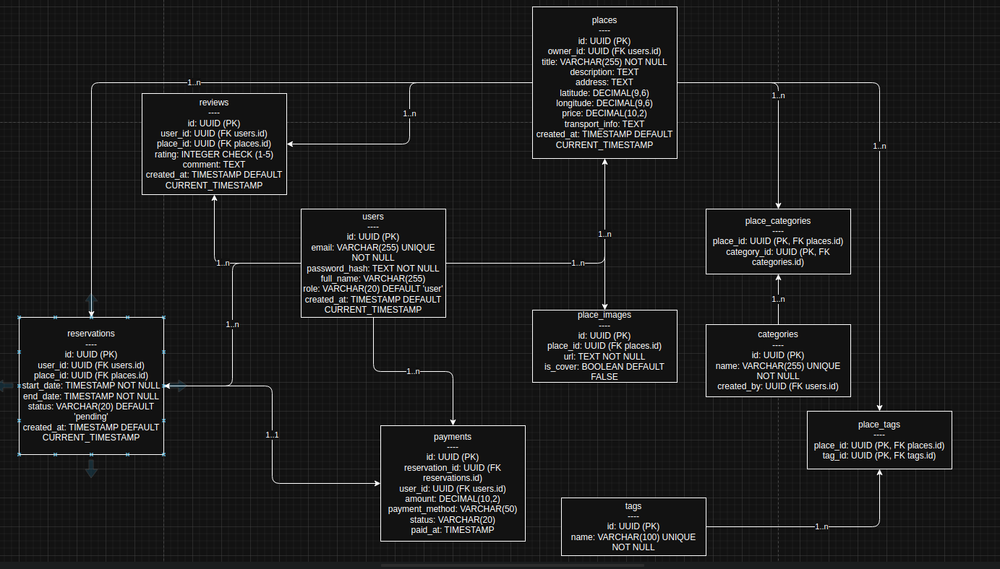

# MyRelaxApp

<a alt="Nx logo" href="https://nx.dev" target="_blank" rel="noreferrer"></a>

✨ Your new, shiny [Nx workspace](https://nx.dev) is almost ready ✨.

[Learn more about this workspace setup and its capabilities](https://nx.dev/nx-api/node?utm_source=nx_project&amp;utm_medium=readme&amp;utm_campaign=nx_projects) or run `npx nx graph` to visually explore what was created. Now, let's get you up to speed!

## Finish your CI setup

[Click here to finish setting up your workspace!](https://cloud.nx.app/connect/usbiE59lLs)


## Run tasks

To run the dev server for your app, use:

```sh
npx nx serve my-relax-app
```

To create a production bundle:

```sh
npx nx build my-relax-app
```

To see all available targets to run for a project, run:

```sh
npx nx show project my-relax-app
```

These targets are either [inferred automatically](https://nx.dev/concepts/inferred-tasks?utm_source=nx_project&utm_medium=readme&utm_campaign=nx_projects) or defined in the `project.json` or `package.json` files.

[More about running tasks in the docs &raquo;](https://nx.dev/features/run-tasks?utm_source=nx_project&utm_medium=readme&utm_campaign=nx_projects)

## Add new projects

While you could add new projects to your workspace manually, you might want to leverage [Nx plugins](https://nx.dev/concepts/nx-plugins?utm_source=nx_project&utm_medium=readme&utm_campaign=nx_projects) and their [code generation](https://nx.dev/features/generate-code?utm_source=nx_project&utm_medium=readme&utm_campaign=nx_projects) feature.

Use the plugin's generator to create new projects.

To generate a new application, use:

```sh
npx nx g @nx/node:app demo
```

To generate a new library, use:

```sh
npx nx g @nx/node:lib mylib
```

To generate library

```sh
pnpm nx g @nx/nest:library --name=shared-prisma --directory=shared/shared-prisma --buildable
```

You can use `npx nx list` to get a list of installed plugins. Then, run `npx nx list <plugin-name>` to learn about more specific capabilities of a particular plugin. Alternatively, [install Nx Console](https://nx.dev/getting-started/editor-setup?utm_source=nx_project&utm_medium=readme&utm_campaign=nx_projects) to browse plugins and generators in your IDE.

[Learn more about Nx plugins &raquo;](https://nx.dev/concepts/nx-plugins?utm_source=nx_project&utm_medium=readme&utm_campaign=nx_projects) | [Browse the plugin registry &raquo;](https://nx.dev/plugin-registry?utm_source=nx_project&utm_medium=readme&utm_campaign=nx_projects)


[Learn more about Nx on CI](https://nx.dev/ci/intro/ci-with-nx#ready-get-started-with-your-provider?utm_source=nx_project&utm_medium=readme&utm_campaign=nx_projects)

## Install Nx Console

Nx Console is an editor extension that enriches your developer experience. It lets you run tasks, generate code, and improves code autocompletion in your IDE. It is available for VSCode and IntelliJ.

[Install Nx Console &raquo;](https://nx.dev/getting-started/editor-setup?utm_source=nx_project&utm_medium=readme&utm_campaign=nx_projects)

## Useful links

Learn more:

- [Learn more about this workspace setup](https://nx.dev/nx-api/node?utm_source=nx_project&amp;utm_medium=readme&amp;utm_campaign=nx_projects)
- [Learn about Nx on CI](https://nx.dev/ci/intro/ci-with-nx?utm_source=nx_project&utm_medium=readme&utm_campaign=nx_projects)
- [Releasing Packages with Nx release](https://nx.dev/features/manage-releases?utm_source=nx_project&utm_medium=readme&utm_campaign=nx_projects)
- [What are Nx plugins?](https://nx.dev/concepts/nx-plugins?utm_source=nx_project&utm_medium=readme&utm_campaign=nx_projects)

And join the Nx community:
- [Discord](https://go.nx.dev/community)
- [Follow us on X](https://twitter.com/nxdevtools) or [LinkedIn](https://www.linkedin.com/company/nrwl)
- [Our Youtube channel](https://www.youtube.com/@nxdevtools)
- [Our blog](https://nx.dev/blog?utm_source=nx_project&utm_medium=readme&utm_campaign=nx_projects)

# DB
## Schema


# TODO list

Monorepo managed by Nx.

## Global Setup

- [x] Setup Nx workspace (apps/libs structure)
- [x] Setup Docker Compose (PostGIS, Redis, pgAdmin)
- [x] Setup Skaffold and Helm for deployments

## DB
- [x] Modeling database schema

## Services

### Gateway (Apollo Federation)

- [ ] Setup Apollo Gateway (Nest.js)
- [ ] Configure subgraphs and service discovery
- [ ] Authentication middleware for token verification
- [ ] Rate Limiting, Caching

### Auth Service

- [ ] Local login/signup with JWT (access + refresh token)
- [ ] MFA (Multi-Factor Authentication)
- [ ] OAuth2 (Google, Facebook, etc.)
- [ ] Device Flow for IoT/Mobile
- [ ] Session management

### Places Service

- [ ] Add, Edit, Delete Places
- [ ] Geolocation fields (PostGIS)
- [ ] Tags and Categories system
- [ ] Image upload

### Reservation Service

- [ ] Create Reservation
- [ ] Cancel Reservation
- [ ] Payment integration hooks
- [ ] Booking calendar

### Reviews Service

- [ ] Add review
- [ ] Rate places
- [ ] Fetch top-rated places

### Location Service

- [ ] Find nearest places
- [ ] Calculate distance matrix
- [ ] Map integration (Google Maps API)

### Payment Service

- [ ] Integrate Stripe or custom provider
- [ ] Handle payment sessions and success/failure callbacks

### Notifications Service
- [ ] Créer `apps/notifications` (NestJS microservice)
- [ ] Configurer transport RabbitMQ ou NATS
- [ ] Implémenter `EventPattern` pour :
    - `reservation.created`
    - `payment.completed`
    - `user.registered`
- [ ] Intégrer **Nodemailer** + templating (Handlebars/EJS)
- [ ] Intégrer SMS (Twilio) et Push (Firebase)
- [ ] Stocker l’historique des notifications (table `notifications`)


## Frontends

### Admin Frontend (Next.js)

- [ ] Dashboard for Prestataires
- [ ] Manage places and pricing
- [ ] Manage reservations
- [ ] Manage reviews and feedback
- [ ] Analytics and Statistics

### Customer Frontend (Next.js)

- [ ] Search places (filter by category, tags, distance)
- [ ] View details of a place
- [ ] Booking system
- [ ] Google Maps integration
- [ ] Leave reviews
- [ ] Payment online

## Shared Libraries

- [ ] shared/ui (shadcn-based)
- [ ] shared/graphql (Apollo Client codegen)
- [ ] shared/zod-schemas (validation everywhere)
- [ ] shared/common (DTOs, types, interfaces)

## Infrastructure

- [ ] PostGIS setup via Helm chart
- [ ] Redis setup via Helm chart
- [ ] pgAdmin access
- [ ] Auto database migrations
- [ ] Centralized logging
- [ ] Monitoring (Prometheus, Grafana)

---

## To-Do Next

- [ ] Setup CI/CD (GitHub Actions)
- [ ] Add E2E tests (Cypress/Playwright)
- [ ] Add Unit tests (Jest)


